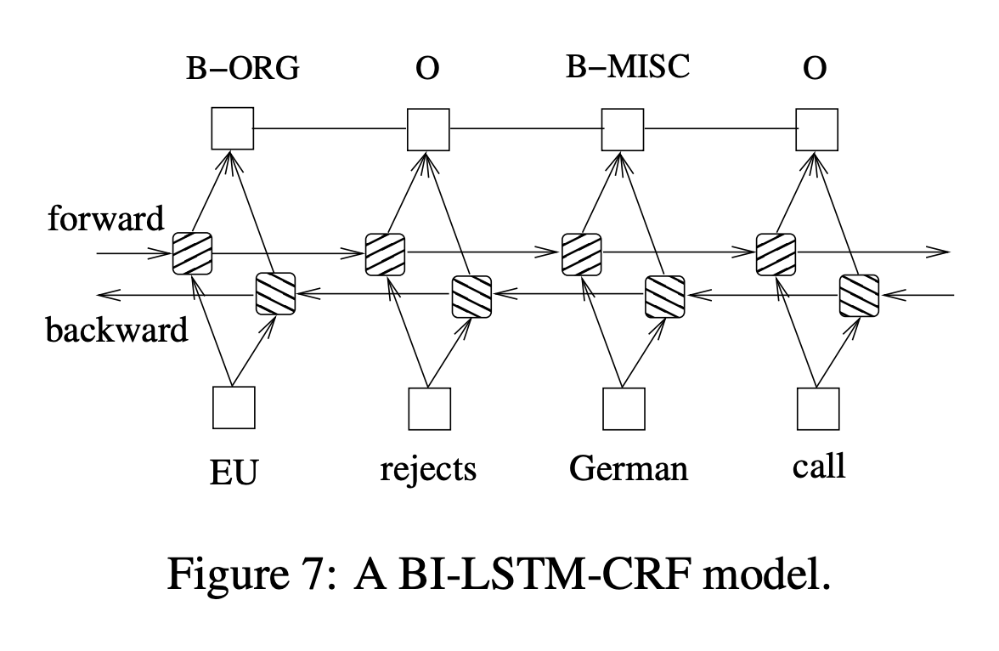

# BiLSTM-CRF
Implementation of BiLSTM-CRF model for Sequence Tagging

[BiLSTM-CRF](https://arxiv.org/pdf/1508.01991v1.pdf) is a simple Deep Learning model for sequence tagging.




#### Installation & Setup
```
pip install -r requirements.txt
```

#### Training:
- Deveopment: run **SequenceTagger.ipynb** either locally or on Google Colab for development
- Training: run **train.py** to fine-tune BiLSTM-CRF on NER dataset and CorNeLL 2017 dataset

#### Inference
```
To be added
```

### Deployment in Tensorflow Serving
```
To be added
```

#### Dependencies
* Tensorflow >= 2.2
* Tensorflow-Addons >= 0.11.1

#### Credits
This repo follows works of [Depends of the definition](https://www.depends-on-the-definition.com/sequence-tagging-lstm-crf/)
